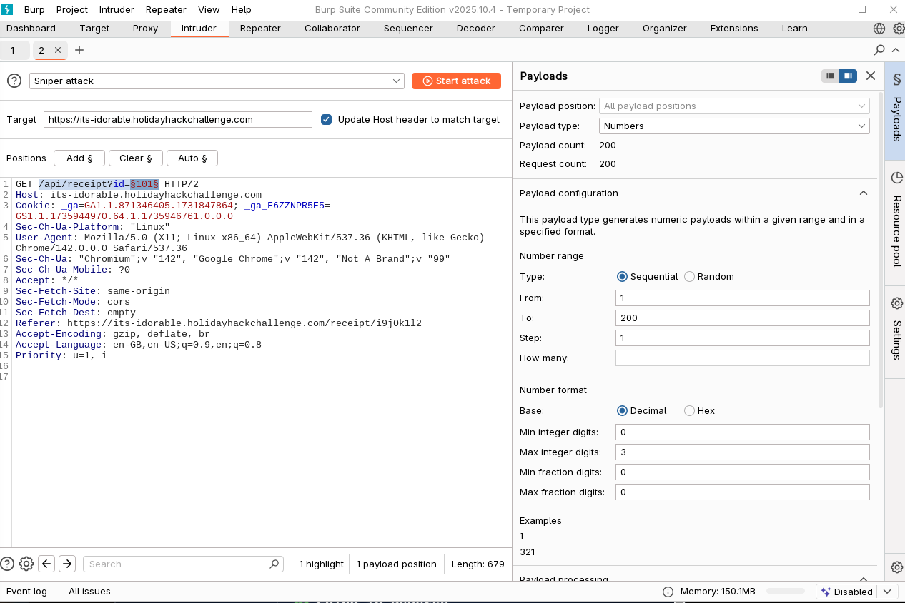

# IDORable Bistro

Difficulty: :material-star::material-star::material-star-outline::material-star-outline::material-star-outline:

## Objective

!!! question "Task description"

    Josh has a tasty IDOR treat for you—stop by Sasabune for a bite of vulnerability. What is the name of the gnome?

??? quote "Josh Wright"

    I'm a teetotling hacker.

    I sleep about 4 hours a night.

    Photography is my hobby, but the anachronistic sort: before 1900.

    Teaching people how to hack and protect systems is my passion.

    I need your help with something urgent.

    A gnome came through Sasabune today, poorly disguising itself as human - apparently asking for frozen sushi, which is almost as terrible as that fusion disaster I had to endure that one time.

    Based on my previous work finding IDOR bugs in restaurant payment systems, I suspect we can exploit a similar vulnerability here.

    I was...at a talk recently...and learned some interesting things about some of these payment systems. Let's use that receipt to dig deeper and unmask this gnome's true identity.

    Oh, you found that receipt? Perfect!

    Did you see that receipt outside the door?

## Hints

??? tip "QR Codes"

    I have been seeing a lot of receipts lying around with some kind of QR code on them. I am pretty sure they are for Duke Dosis's Holiday Bistro. Interesting...see you if you can find one and see what they are all about...

??? tip "What's For Lunch?"

    I had tried to scan one of the QR codes and it took me to somebody's meal receipt! I am afraid somebody could look up anyone's meal if they have the correct ID...in the correct place.

??? tip "Will the Real ID Please..."

    Sometimes...developers put in a lot of effort to anonymyze information by using randomly generated identifiers...but...there are also times where the "real" ID is used in a separate Network request...

## Solution

This challenge is about [insecure direct object references (IDOR)](https://www.youtube.com/watch?v=hzrhtHrhwno). We are presented with a receipt verification system using QR codes.

We can find a receipt laying on the ground outside of the restaurant (or via [this](https://www.holidayhackchallenge.com/2025/assets/receipt.png) link):


/// caption
Receipt.
///

The QR code on the receipt links to [this](https://its-idorable.holidayhackchallenge.com/receipt/i9j0k1l2) URL:

`https://its-idorable.holidayhackchallenge.com/receipt/i9j0k1l2`

The system seems to use a relatively long unique receipt ID in the URL that cannot easily be brute forced. However, when looking more closely at the actual requests being made using Burp, we see that an API request is made to `/api/receipt?id=103`. This type of ID is not unique and can easily be guessed. We can leverage the Burp Intruder to do this:


/// caption
Leverage Burp Intruder to brute force ID.
///

When doing this we will find many different receipt with funny notes. However, ID `139` gives us the following related to the question asked in the dialogue:

```
{"customer":"Bartholomew Quibblefrost","date":"2025-12-20","id":139,"items":[{"name":"Frozen Roll (waitress improvised: sorbet, a hint of dry ice)","price":19.0}],"note":"Insisted on increasingly bizarre rolls and demanded one be served frozen. The waitress invented a 'Frozen Roll' on the spot with sorbet and a puff of theatrical smoke. He nodded solemnly and asked if we could make these in bulk.","paid":true,"table":14,"total":19.0}
```

??? success "Solution"

    The solution to this question is `Bartholomew Quibblefrost`.

## Images


/// caption
Challenge webpage.
///

## Response

!!! quote "Josh Wright"

    Excellent work exploiting that IDOR vulnerability - textbook execution.

    Now we know exactly which gnome tried to pass itself off as a sushi connoisseur. Frozen rolls... honestly, what's next?
